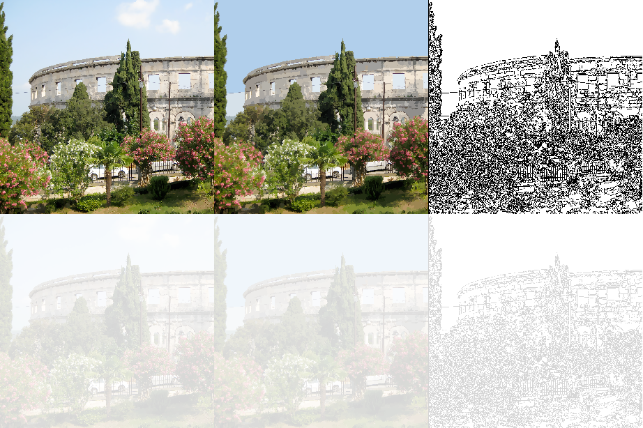

### High Performance Computing on Graphics Processing Units
#### Mean Shift Image Segmentation
Mean shift is a non-parametric feature-space analysis technique for locating the maxima of a density function, a so-called mode-seeking algorithm. Application domains include cluster analysis in computer vision and image processing.

#### Master Thesis

[Thesis.pdf](https://github.com/zvonkok/gpu-meanshift-segmentation/blob/master/latex/Thesis/trunk/Thesis.pdf)

Today’s Graphic Processing Units (gpus) are not only good for gaming
and graphics processing their highly parallel structure is predestined for
a range of complex algorithms. They offer a tremendous memory bandwidth
and computational power. Contrary to Central Processing Units
(cpus), gpus are accelerating quickly and advancing at incredible rates
in terms of absolute transistor count. Implementing a massively parallel,
unified shader design, its flexibility and programmability makes the
gpu an attractive platform for general purpose computation. Recent improvements
in its programmability, especially high level languages (like
C or C++), gpus have attracted developers to exploit the computational
power of the hardware for general purpose computing.
Several gpu programming interfaces and Application Programming
Interfaces (apis) represent a graphics centric programming model to
developers that is exported by a device driver and tuned for real time
graphics and games. Porting non-graphics applications to graphics
hardware means developing against the graphics programming model.
Not only the diffculties of the unusual graphics centric programming
model but also limitations of the hardware makes development of nongraphics
applications a tedious task.

Therefore nVidia Corporation developed the Common Unified
Device Architecture (cuda) that is a fundamentally new computing 
architecture that simplies sofware development by using the standard C
language. Using cuda this thesis will show on the basis of an massively
parallel application in which extent gpus are suitable for general purpose
computation. Special attention is paid to performance, computational
concepts, efficient data structures and program optimization.

The result of this work is the demonstration of feasibility of General
Purpose Computation on gpus (gpgpu). It will show that gpus are
capable of accelerating specific applications by an order of magnitude.

This work will represent a general guideline for suggestions and hints
as well as drawbacks and obstacles when porting applications to gpus.

#### CUDA (multi gpu) Implementation of Mean-Shift
[cuda-meanshift](https://github.com/zvonkok/gpu-meanshift-segmentation/tree/master/code/meanshiftfilter/trunk)
#### OpenCL Implementation of Mean-Shift
[opencl-meanshift](https://github.com/zvonkok/gpu-meanshift-segmentation/tree/master/code/meanshiftfilter/branches/oclmeanshiftfilter)
